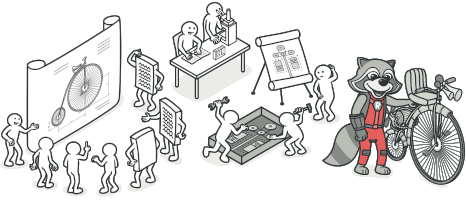

# Проект "Паттерны проектирования на Python"

## Описание

Этот проект реализует различные паттерны проектирования на языке Python. Паттерны проектирования помогают организовать
код таким образом, чтобы он был более гибким, удобным для поддержки и масштабирования. В каждом файле есть краткое
описание паттерна. Проект был создан для удобного и наглядного повторения паттерров при необходимости.

## Паттерны Проектирования

### Порождающие (Creational)

- [x] Фабричный Метод (Factory Method)
- [x] Абстрактная Фабрика (Abstract Factory)
- [x] Одиночка (Singleton)
- [x] Строитель (Builder)
- [x] Прототип (Prototype)

### Структурные (Structural)

- [x] Адаптер (Adapter)
- [x] Мост (Bridge)
- [x] Компоновщик (Composite)
- [x] Декоратор (Decorator)
- [x] Фасад (Facade)
- [x] Легковес | Приспособленец | Кэш (Flyweight)
- [x] Заместитель (Proxy)

### Поведенческие (Behavioral)

- [ ] Цепочка Обязанностей (Chain of Responsibility)
- [ ] Команда (Command)
- [ ] Итератор (Iterator)
- [ ] Посредник (Mediator)
- [ ] Хранитель (Memento)
- [ ] Наблюдатель (Observer)
- [ ] Состояние (State)
- [ ] Стратегия (Strategy)
- [ ] Шаблонный Метод (Template Method)
- [ ] Посетитель (Visitor)

## Запуск проекта

* Установить зависимости через <code>pip install -r requirements.txt</code>
* Создать <code>.env</code> файл и заполнить его данными по примеру.

Примеры кода разработаны и протестированы на Python 3.10 и выше.

Изучал паттерны с помощью книги Gang of Four и сайта Refactoring Guru. Классная картинка также взята с их сайта.

Если вам чем-то помог мой проект, то поставьте звездочку :)
